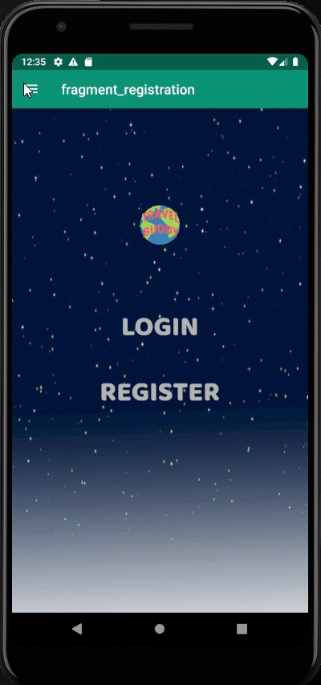

  

# Travel Buddy

Whether you're a hiker, trekking, or cardio, spending time walking through nature is relaxing. With our application, one can simply the greatest hiking experience. One can look for a good rating on a landmark and enjoy their afternoon trip.

# Register Page

* Users will be able to register for an account.
  * Username
  * Password
  * First Name
  * Last Name
  * Age
  * Home Town

# Login Page

* Users will be able to login.
* After login users can stay logged in even after closing the app. (token)
* The user will have access to edit or delete their landmarks.

# Map Page

* Users will be able to click on existing landmarks, if they're the author of such landmark they can choose to delete or edit the landmark.
* Users can also touch and hold a location on the map to add a landmark and rating of their own. The user will see the page below when adding a new landmark.

# Edit Page

* If the user is the author, they will see this on the top right of the screen.

* Otherwise the user sees the below image and can add a rating for the landmark.

# Rating
* Users can simply decide what is the appropriate star value for a landmark by sliding their finger across the stars.
* The current rating is calculated by getting the average.

11/17/19  
There are now 2 fragments - TitleFragment & MapFragment  

The map and all current functionality is accessible through MapFragment.kt and fragment_map.xml  

11/22/19 
Added the review fragments and input options for testing 
Navigation implentation needed 
<ul>
  <li>Review fragment</li>
  <li>Styles, String and Colors xml files</li>
</ul>
 

11/26/19 
Added a LandmarkFragment   
<ul>
  <li>Displays the individual landmark page</li>
  <li>Includes title, description, and rating of landmark</li>
  <li>Future: Will have the functionality to submit a rating</li>
</ul>
 

11/30/19 
Add Landmark functionality is complete!   
Users can now hold down the map at desired point to add landmarks! Once users choose a destination, they will be prompted with input fields so they can enter the title, description, and rating of the landmark they are adding. Once successfully added, users will be redirected to the MapFragment, where their new landmark is a pin on the map.
 

12/7/19 
When a user clicks a marker pop up window on the map they are taken to that landmark's page.

  

## Contributors

| Team Members | GitHub Username |
| ------ | ------ |
| Nikita Aggarwal | nikita1369 |
| Gabriela Alvarado | gaby-a |
| Brandon Arevalo | ArevaloBrandon115 |
|Jose Gracia| josejesusgarciajr |
|Justine West| jwest115 |

## Version history
| Ver. | Date implement | Description |
| ------ | ------ | ------ |
| v.1 | 10/27/2019 | First draft. |
| v.2 | 11/01/2019 | Display Google maps on MainActivity. |
| v.3 | 11/17/2019 | Navigation.xml, TitleFragment, MapFragment displaying the map alone. |
| v.4 | 11/22/2019 | Firebase, review fragments, input options testing. |
| v.5 | 11/26/2019 | LandmarkFragment displaying the landmarks on page.  |
| v.6 | 11/30/2019 | Users can now press and hold to add landmarks and rate the location added. |
| v.7 | 11/27/2019 | Users can now click on landmarks to add a rating. |
| v.8 | 12/09/2019 | User login and registration implemented for landmark edit/delete function. |
